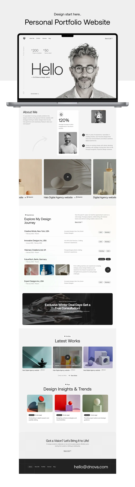

# Personal Portfolio Website

A modern and professional personal portfolio website showcasing design work, experience, and blog articles.

## 🔐 Secure Supabase CMS - GitHub Actions + Encrypted Secrets

Repository ini juga dilengkapi dengan **Supabase CMS** yang menggunakan GitHub Actions untuk secara otomatis inject kredensial saat deploy ke GitHub Pages, menjaga keamanan credentials tanpa mengorbankan kemudahan static hosting.

### 📁 Struktur CMS

```
├── index.html              # File utama website (tidak berubah)
├── admin/
│   ├── dashboard.html      # Admin dashboard dengan auth
│   └── testing.html        # CRUD testing interface
├── assets/
│   └── js/
│       └── config.js       # Template config (diisi GitHub Actions)
└── .github/
    └── workflows/
        └── deploy.yml      # Automated deployment
```

### 🚀 Cara Setup CMS

#### 1. Setup GitHub Secrets

1. Buka repository di GitHub
2. Pergi ke **Settings** → **Secrets and variables** → **Actions**
3. Klik **New repository secret** dan tambahkan:
   - **SUPABASE_URL:** `https://your-project-id.supabase.co`
   - **SUPABASE_ANON_KEY:** `eyJhbGciOiJIUzI1NiIsInR5cCI6IkpXVCJ9...`

#### 2. Enable GitHub Pages
- **Settings** → **Pages** → Source: **GitHub Actions**

#### 3. Setup Database Schema

Buka Supabase Dashboard → SQL Editor dan jalankan:

```sql
-- 1. Buat tabel users
CREATE TABLE IF NOT EXISTS users (
  id BIGSERIAL PRIMARY KEY,
  name TEXT NOT NULL,
  email TEXT NOT NULL,
  description TEXT,
  user_id UUID REFERENCES auth.users(id) ON DELETE CASCADE,
  created_at TIMESTAMP WITH TIME ZONE DEFAULT NOW()
);

-- 2. Buat tabel profiles untuk role management
CREATE TABLE IF NOT EXISTS profiles (
  user_id UUID PRIMARY KEY REFERENCES auth.users(id) ON DELETE CASCADE,
  username TEXT UNIQUE,
  role TEXT DEFAULT 'user',
  created_at TIMESTAMP WITH TIME ZONE DEFAULT NOW()
);

-- 3. Enable RLS dan buat policies
ALTER TABLE users ENABLE ROW LEVEL SECURITY;
ALTER TABLE profiles ENABLE ROW LEVEL SECURITY;

CREATE POLICY "profiles_self_only" ON profiles
  FOR ALL USING (auth.uid() = user_id) WITH CHECK (auth.uid() = user_id);

CREATE POLICY "users_owner_crud" ON users
  FOR ALL USING (auth.uid() = user_id) WITH CHECK (auth.uid() = user_id);

CREATE POLICY "users_admin_bypass" ON users
  FOR ALL USING (
    EXISTS (SELECT 1 FROM profiles WHERE profiles.user_id = auth.uid() AND profiles.role = 'admin')
  ) WITH CHECK (
    EXISTS (SELECT 1 FROM profiles WHERE profiles.user_id = auth.uid() AND profiles.role = 'admin')
  );
```

#### 4. Buat Admin User

1. Supabase Dashboard → Authentication → Add user
2. Email: `admin@example.com`, Password: `QWEasd123`
3. Insert admin profile:

```sql
INSERT INTO profiles (user_id, username, role)
SELECT id, 'admin', 'admin' FROM auth.users WHERE email = 'admin@example.com';
```

### 🔧 Cara Kerja

- **Development:** Edit `assets/js/config.js` atau gunakan localStorage panel
- **Production:** GitHub Actions otomatis inject credentials dari GitHub Secrets
- **Security:** Credentials tidak pernah tersimpan di repository, RLS melindungi data

### 📱 URL CMS

- **Admin Dashboard:** `https://refgiufi.github.io/admin/dashboard.html`
- **Testing Interface:** `https://refgiufi.github.io/admin/testing.html`

---

## 🎨 Design Reference



> **Note:** Simpan gambar referensi desain ke folder `assets/design-reference.png` untuk menampilkan preview desain.

The website design is based on a modern portfolio template featuring:
- Clean and minimal aesthetic
- Professional typography
- Grid-based layout
- Responsive design
- Smooth animations and transitions

## ✨ Features

- **Hero Section** - Eye-catching introduction with statistics and call-to-action
- **About Me** - Professional introduction with achievements and skills
- **Portfolio Grid** - Showcase of selected projects
- **Experience Timeline** - Detailed work history with visual elements
- **Latest Works** - Featured recent projects
- **Blog Section** - Design insights and articles
- **Contact Section** - Easy way to get in touch

## 🚀 Technologies Used

- HTML5
- CSS3 (with Grid & Flexbox)
- Vanilla JavaScript
- Responsive Design
- Images from Unsplash

## 📱 Responsive Design

The website is fully responsive and optimized for:
- Desktop (1400px+)
- Tablet (768px - 1399px)
- Mobile (< 768px)

## 🌐 Live Demo

Visit the live site: [https://refgiufi.github.io](https://refgiufi.github.io)

## 📄 License

This project is open source and available under the MIT License.

## 👤 Author

**refgiufi**
- Instagram: [@refgiufi](https://www.instagram.com/refgiufi)
- Email: hello@dnhova.com

---

© 2025 refgiufi. All rights reserved.
